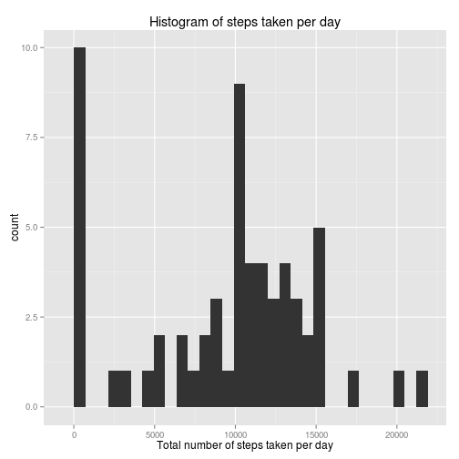
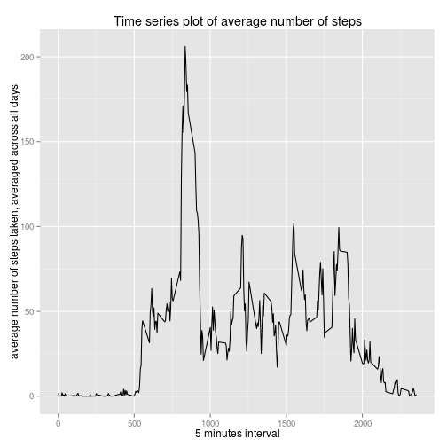
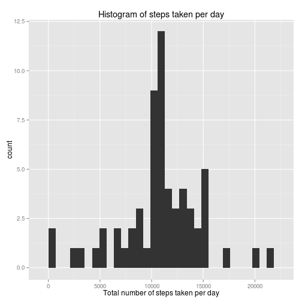
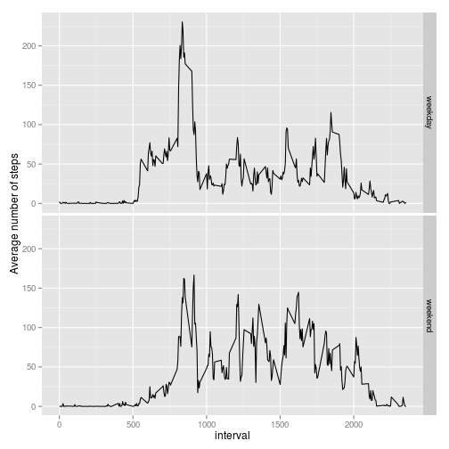

# Reproducible Research: Peer Assessment 1


## Loading and preprocessing the data
### Q1) 

```r
unzip(zipfile="activity.zip")
data <- read.csv("activity.csv",header=TRUE)
#illustrate the column names
names(data)
```

```
## [1] "steps"    "date"     "interval"
```

```r
head(data)
```

```
##   steps       date interval
## 1    NA 2012-10-01        0
## 2    NA 2012-10-01        5
## 3    NA 2012-10-01       10
## 4    NA 2012-10-01       15
## 5    NA 2012-10-01       20
## 6    NA 2012-10-01       25
```

## What is mean total number of steps taken per day?
### Q2a)

```r
require(ggplot2)
```

```
## Loading required package: ggplot2
## Use suppressPackageStartupMessages to eliminate package startup messages.
```

```r
totalNumberOfSteps <- tapply(data$steps, data$date, FUN=sum, na.rm=TRUE)
qplot(totalNumberOfSteps,xlab="Total number of steps taken per day",main="Histogram of steps taken per day")
```

```
## stat_bin: binwidth defaulted to range/30. Use 'binwidth = x' to adjust this.
```

 

### Q2b) Calculate and report the mean and median total number of steps taken per day

```r
mean(totalNumberOfSteps, na.rm=TRUE)
```

```
## [1] 9354.23
```

```r
median(totalNumberOfSteps, na.rm=TRUE)
```

```
## [1] 10395
```

## What is the average daily activity pattern?
### Q3a) Make a time series plot (i.e. type = "l") of the 5-minute interval (x-axis) and the average number of steps taken, averaged across all days (y-axis)

```r
ave <- aggregate(x=list(steps=data$steps), by=list(interval=data$interval),FUN=mean, na.rm=TRUE)
ggplot(data=ave, aes(x=interval, y=steps))+geom_line()+xlab("5 minutes interval")+ylab("average number of steps taken, averaged across all days")+labs(title="Time series plot of average number of steps")
```

 

### Q3b) Which 5-minute interval, on average across all the days in the dataset, contains the maximum number of steps?

```r
c("The maximum number of steps is: ",ave[which.max(ave$steps),]$steps)
```

```
## [1] "The maximum number of steps is: " "206.169811320755"
```

```r
c("The corresponding 5-minute interval is: ",ave[which.max(ave$steps),]$interval)
```

```
## [1] "The corresponding 5-minute interval is: "
## [2] "835"
```

```r
c("The corresponding index is: ",which.max(ave$steps))
```

```
## [1] "The corresponding index is: " "104"
```

## Imputing missing values
### Q4a) Calculate and report the total number of missing values in the dataset 


```r
missingSteps <- sum(is.na(data$steps))
missingDate <- sum(is.na(data$date))
missingInterval <- sum(is.na(data$interval))
missingSteps+missingDate+missingInterval
```

```
## [1] 2304
```

### Q4b) Devise a strategy for filling in all of the missing values in the dataset. The strategy does not need to be sophisticated. For example, you could use the mean/median for that day, or the mean for that 5-minute interval, etc.


```r
# Replace each missing value with the mean value of its 5-minute interval
fillupData <- function(steps, interval) {
    filled <- c(steps)        
    if(is.na(steps))    
        filled <- (ave[ave$interval==interval, "steps"])
    return(filled)
}
data2<-data
data2$steps <- mapply(fillupData, data$steps, data$interval)
```
Now, using the filled data set, let's make a histogram of the total number of steps taken each day and calculate the mean and median total number of steps.


```r
totalNumberOfSteps2 <- tapply(data2$steps, data2$date, FUN=sum)
qplot(totalNumberOfSteps2,xlab="Total number of steps taken per day",main="Histogram of steps taken per day")
```

```
## stat_bin: binwidth defaulted to range/30. Use 'binwidth = x' to adjust this.
```

 

```r
mean(totalNumberOfSteps2)
```

```
## [1] 10766.19
```

```r
median(totalNumberOfSteps2)
```

```
## [1] 10766.19
```
Upon the removal of missing data originally given as NAs, it is found that both mean and median increases. It is worth mentioning that the we have chosen the NA steps values by the average (mean) values for the corresponding intervals.

## Are there differences in activity patterns between weekdays and weekends?
Determine whether the recorded date are either weekdays or weekends.

```r
checkWeekdays <- function(date) {
    day <- weekdays(as.Date(date))
    if (day %in% c("Monday", "Tuesday", "Wednesday", "Thursday", "Friday"))
        return("weekday")
    else return("weekend")
}
data2$day <- sapply(data2$date, FUN=checkWeekdays)
```
Plot the average number of steps separately for weekdays and weekends.

```r
ggplot(aggregate(steps ~ interval + day, data=data2, mean), aes(interval, steps)) +
 geom_line() +
 facet_grid(day ~ .) + 
 xlab("interval")+ 
 ylab("Average number of steps")
```

 
